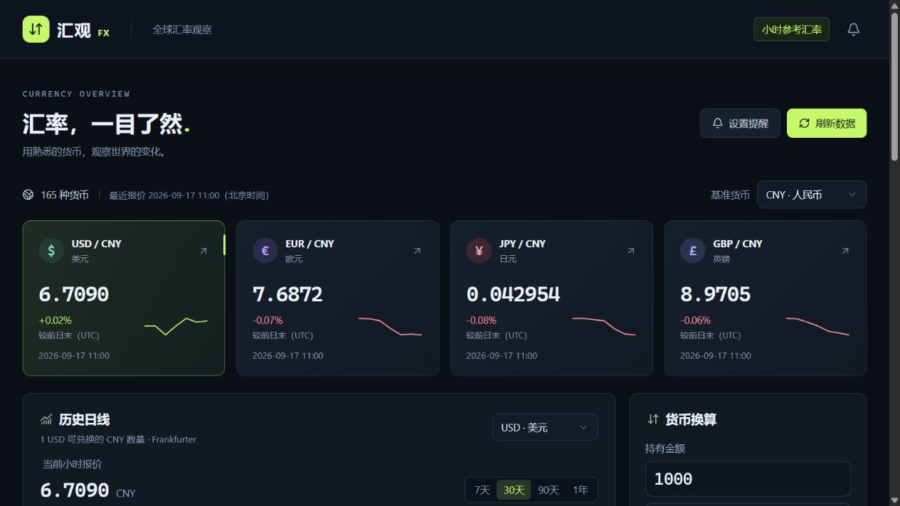

# 汇观 FX · 全球汇率看板

中文汇率查询工具：小时参考报价、历史日线、双向换算和本机到价提醒。基于 React、TypeScript、Vinext / Vite 与 Cloudflare Workers 本地运行环境。



截图为运行时快照，报价与时间以实际数据源为准。

## 功能

- **小时报价**：Open Exchange Rates 提供当前报价，列表、换算和提醒共享缓存，显示实际发布时间（北京时间）。
- **货币列表**：人民币为默认基准，支持切换基准、中文或代码搜索、排序、常用及自选列表。
- **历史日线**：Frankfurter 提供 7 天、30 天、90 天、1 年区间，支持悬浮查看和展开数据。
- **双向换算**：自动计算交叉汇率，不包含银行买卖价差和手续费。
- **本机提醒**：高于或低于目标时触发一次；自选、提醒和设置保存在当前浏览器。
- **状态透明**：区分小时报价、每日备用数据和缓存，接口异常时保留原始报价时间，不生成模拟行情。

## 快速开始

需要 **Node.js 22.13 或更新版本**，以及可访问数据源的网络。

```sh
git clone https://github.com/ggh-cioud/huiguan-fx.git
cd huiguan-fx
npm run install:ci
```

复制 `.env.example` 为 `.env.local`，填入自己的 [Open Exchange Rates App ID](https://openexchangerates.org/signup/free)：

```dotenv
OPEN_EXCHANGE_RATES_APP_ID=你的AppID
```

然后构建并启动：

```sh
npm run build
npm run start -- --port 5173
```

打开 **http://127.0.0.1:5173/**。首次安装和构建后，Windows 用户可双击 `启动汇率网站.cmd` 启动。保持服务终端运行；关闭终端后，本机网址将无法访问。修改源码后需重新构建，Windows 上请先停止旧服务，避免占用构建目录。开发模式可使用 `npm run dev`。

未配置 App ID 时仍可使用 Frankfurter 每日参考数据，页面显示“小时级待启用”。保存 App ID 后需要重启服务；配置后的认证、额度或网络错误会明确显示。

## 配置与隐私

- App ID 只在服务端读取，通过 Authorization 请求头访问上游，不写入网页或 API 响应。
- `.env.local`、运行缓存和构建产物均由 Git 忽略；请勿上传自己的密钥。
- 普通本机运行会自动使用 `.openai/hosting.example.json`。可选的个人 Sites 配置放在 `.openai/hosting.json`，该文件不再纳入版本控制。
- 自选、提醒、刷新开关和最后报价保存在本机浏览器，没有账号同步。
- GitHub 仓库提供源码；本机启动地址仅在运行服务的电脑上可用。公网部署需要单独配置运行环境与服务端密钥。

## 更新频率与数据口径

页面保持打开且自动更新开启时，每小时检查新报价；回到页面或恢复联网也会检查服务端缓存。服务端按需更新，共享一份 USD 基准报价，并每天获取前日末报价用于计算涨跌幅。

按每小时一次最新报价、每天一次前日末报价计算，连续运行 30 天约需 750 次上游请求，31 天约需 775 次。手动刷新、切换基准和换算共享缓存，重启后可复用仍有效的本机缓存。失败重试、清空缓存或运行多个独立实例会增加用量；账户额度以提供商当前套餐为准。

列表统一表示 **1 单位行内货币可兑换多少基准货币**，例如基准为 CNY 时，USD 行表示 `1 USD = x CNY`。交叉换算公式为 `rates[to] / rates[from]`，相同货币换算为 1。

小时报价的涨跌幅对比同一数据源的**前一个 UTC 日末**，不是滚动 24 小时变化。UTC 日末对应北京时间次日约 08:00；页面显示实际对比时间，缺少历史报价时显示“暂无对比”。

历史主图与小趋势图均使用 Frankfurter 日线，不把小时数据拼接进日线，也不跨数据源计算涨跌幅。两个来源可能略有差异，部分币种只有当前报价、没有日线，周末数值也可能不变。

## 使用限制

- 展示的是参考汇率，不是银行承诺的买入、卖出或成交价，也不是交易执行系统。
- 到价提醒仅在页面运行且联网时检查；关闭页面后不会后台推送。
- 小时报价超过 2 小时、时间无效或超前超过 5 分钟时，不参与提醒触发；每日备用数据超过 4 天时同样停止触发。
- 数据源的可用性、覆盖范围和套餐会影响功能。源码许可证不包含对第三方汇率数据的转售授权，请查看 [Open Exchange Rates 条款](https://openexchangerates.org/terms) 和 [Frankfurter 文档](https://frankfurter.dev/)。
- 支持 `document.modelContext` 的浏览器可使用可选的 `read_exchange_rates` 和 `convert_currency` 工具；不支持时不影响普通操作。

数据源文档：[当前报价](https://docs.openexchangerates.org/reference/latest-json) · [前日末报价](https://docs.openexchangerates.org/reference/historical-json) · [Frankfurter](https://frankfurter.dev/)

## 开发与验证

```sh
node node_modules/typescript/bin/tsc --noEmit
node scripts/verify-domain.mjs
node scripts/verify-hourly.mjs
npm run build
```

本地服务运行后，在 PowerShell 7.5 或更新版本执行 `./scripts/verify-api.ps1 -ExpectedFrequency hourly`，再运行 `node scripts/verify-secrets.mjs`。这两项检查需要有效的本机 App ID 和网络，结果写入被 Git 忽略的 `outputs/`。

固定规则检查覆盖日常换算、小时缓存边界、并发请求合并、同源涨跌幅、失败处理和提醒失效条件。集成检查验证真实接口响应；密钥检查只报告是否泄漏，不输出密钥。可控时钟测试不等同于持续运行一小时的现场计时验证。

| 路径 | 作用 |
| --- | --- |
| `app/dashboard.tsx`、`app/fx-components.tsx` | 页面、图表与换算界面 |
| `app/use-market.ts`、`app/rate-alerts.tsx` | 浏览器缓存与到价提醒 |
| `lib/fx.ts` | 数据类型、换算与提醒规则 |
| `lib/oxr.ts` | 小时报价、认证、请求合并与持久缓存 |
| `lib/fx-server.ts`、`app/api/` | 服务端接口与数据源适配 |
| `scripts/sites-env.mjs` | 启动时读取项目根目录的本机环境配置 |

## 许可证

项目代码采用 [MIT 许可证](LICENSE)。第三方代码与数据说明见 [THIRD_PARTY_NOTICES.md](THIRD_PARTY_NOTICES.md)。
